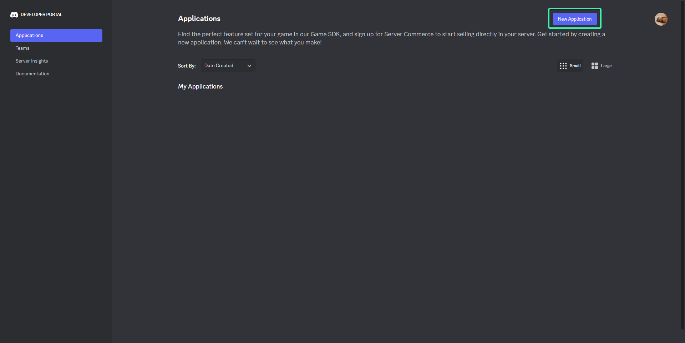
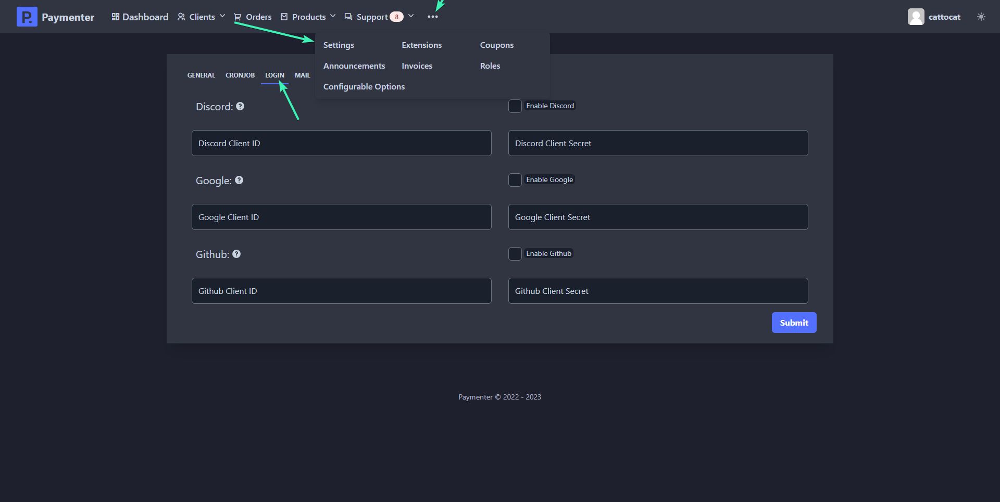
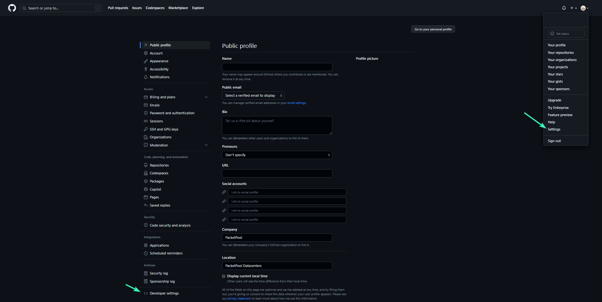
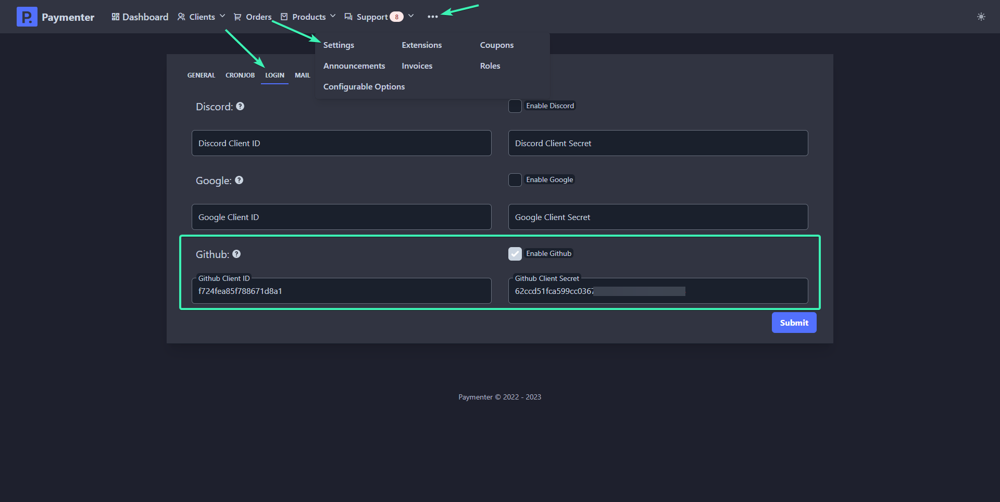
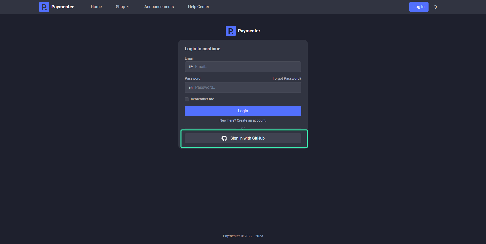

A simple tutorial on how to add oAuth authorization to your Paymenter

# Discord OAuth

First locate to [Discord Developer Page](https://discord.dev) and click on New application.

Name your application and hit create.
After that navigate to OAuth2 and click on Add Redirect
and add Paymenter OAuth callback URL (https://yourdomain.here/login/discord/callback).
After that click on Reset Secret, The page should look like this.

Now go to your Paymenter admin area and navigate to settings (... (Three dots) -> Settings --> Login)

Enable Discord feature and fill in the Discord Client ID & Discord Client Secret with the one showed in your Discord's developer page.
Should look like this.

Hit submit to save all changes and Discord OAuth should be working and visible in login page.

# Github OAuth

Locate to [Github Account Settings](https://github.com/settings/profile) scroll down and click on Developer Settings
as showed in the image.

Click on OAuth Apps and click on Register a new application

Create a new application with the callback (https://yourdomain.here/login/github/callback)
Should look something like this.

Click on Register Application, and Generate a new client secret
The github page should look simillar to this.

Copy your Client ID & Client Secret and deploy it on Paymenter

After that, click on submit to save changes and Github OAuth should be working,
You can verify this by going to the login page and clicking on Sign in with GitHub.

# Google OAuth

Locate to [Google API & Services Dashboard](https://console.cloud.google.com/apis/dashboard) and click on New application.
Create a new project if you don't have it, after that go to OAuth consent screen, select external and click create

After that fill in your Application name, support email, logo etc.
Should look simillar to this

Click on Save and Continue, after that navigate to Credentials and Create Credentials

Select Web application the application name doesn't matter, for Authorized redirect URIs put (https://yourdomain.here/login/google/callback)
and click save. After that you should see your Client ID and Client Secret, copy both of these and go to your Paymenter admin area
and navigate to settings (... (Three dots) -> Settings --> Login) Paste the Client ID and Client Secret and click submit to save changes. 
Should look something like this.

Keep in mind that you will need to publish your OAuth application via OAuth consent screen, This required
you to have 

* An official link to your app's Privacy Policy
* A YouTube video showing how you plan to use the Google user data you get from scopes
* A written explanation telling Google why you need access to sensitive and/or restricted user data
* All your domains verified in Google Search Console
